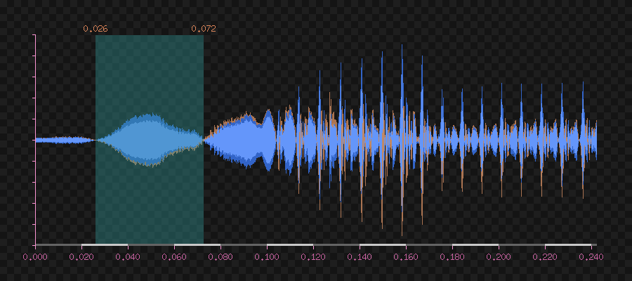

# go-waveform

Go module to generate and render waveform images from audio files

Example :


We can zoom :



# TODO

* doc
* add range
* add segment
* add labels

# Usage :

```go
import (
    // ...
	"github.com/xigh/go-waveform"
	"github.com/xigh/go-wavreader"
)

func main() {
	r, err := os.Open("test-hello.wav")
	if err != nil {
		return err
	}
	defer r.Close()
	
	w0, err := wavreader.New(r)
	if err != nil {
        return err
    }
    
	img := waveform.MinMax(w1, &waveform.Options{
		Width:   1800,
		Height:  400,
		Zoom:    1.7,
		Half:    false,
		MarginL: *margin,
		MarginR: *margin,
		MarginT: *margin,
		MarginB: *margin,
		Front: &color.NRGBA{
			R: 255,
			G: 128,
			B: 0,
			A: 150,
		},
		Back: &color.NRGBA{
			A: 0,
		},
	})

	w, err := os.Create("test-minmax.png")
	if err != nil {
		return err
	}
	defer w.Close()

	err = png.Encode(w, img)
	if err != nil {
		return err
    }
}
```
